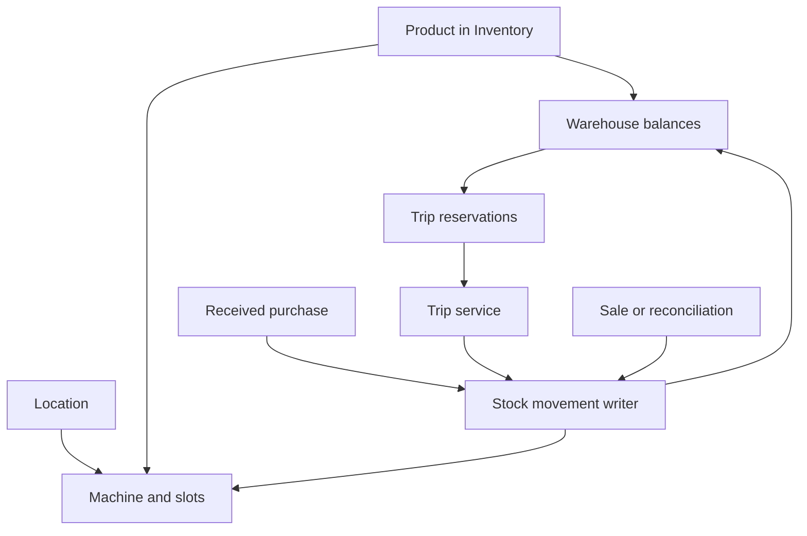

# SmartVendingOS development milestones

Documentation-only plan reviewed on 2026-09-16 against repository commit `20d5bf1cd6655c176f844cdb4fdca84e63970ab0`.

Read this index, then execute one milestone document at a time. Each milestone includes its frontend, backend, schema needs, business rules and tests. These documents specify future implementation; they do not certify that the current application works in production.

## Sources and precedence

1. The user's current scope and attached `Pasted markdown.md`: documentation only; five excluded modules; products remain within Inventory; frontend/backend together; VendSoft workflow reference; existing-code review and no unassigned connections.
2. This completed milestone set: proposed architecture and explicit decisions for implementing the reduced scope.
3. [Requirements](../../SmartVendingOS_requirement.md), originally a UI-only demo specification, and [system overview](../SYSTEM_OVERVIEW.md), an earlier build plan. Their mock-data behaviors, excluded modules and unverified claims do not override the current plan.
4. Source code at the reviewed commit is the evidence for Current State. New proposed paths/functions/tables are requirements, not claims of existing code.

Reviewed all 1,569 lines of the requirement file, the prior milestone index/foundation, the system overview, numbered schema files, source navigation/auth/tenant code, provider types and operational screen implementations. This was a static source review; no dependencies installed, no application tests/build run, no live database queried, no integrations executed. Historical docs claim the database is live; that state was not independently verified here.

## What was incomplete or stale in the previous milestone work

| Finding | Evidence / correction |
|---|---|
| Index listed ten milestones, only 01 existed | Complete 02-10 here; add 11 for deployment work already in the overview. |
| Foundation prescribed removing a session-secret fallback | `src/utils/session.ts` already throws when missing. Keep and verify it. |
| Foundation described two independent nav lists | One `NAV_ITEMS` constant is used by desktop and mobile renderings. Test both. |
| Foundation described a working password setup page | Only an email-based API exists; token-protected page/flow is required. |
| Tenant resolution was described as finished | Current helper has arbitrary first membership and ambiguous demo fallback. M01 distinguishes principal kinds and suspended memberships. |
| Late configuration created hidden dependencies | M01 minimal members; M03 warehouses/types/tags; M05 suppliers/packs; M06 vehicles; M07 provider/problems. M09 reuses these. |
| Removing all map components would break trips | M01 removes fleet map consumers; keeps RouteMap while operational routes use it. |
| Deleting reserved route names could turn them into public company slugs | M01 separates reserved route names from allowed route rewriting. |
| Opening balance was said to make duplicate stock impossible | Idempotency prevents duplicate submission, not a second separately entered purchase of the same shipment. Source attestation and duplicate review are explicit. |
| Trip/DEX/sale semantics could overwrite or double-deplete stock | M03 single writer; M06 coverage and movement references; M07 timestamp-aware reconciliation. |
| Reports used current costs or conflated cash/sales | M07 immutable event snapshots; M08 distinct sale, stock, collection and settlement facts. |
| Fresh DB installation assumed migrations seed a usable identity | M01 owns identity/bootstrap; M11 separates sample seed and verifies fresh/upgrade/restore. |

## Sequence and deliverables

| # | File | Complete functional outcome | Prerequisites |
|---|---|---|---|
| 01 | [milestone-01-foundation-and-navigation.md](milestone-01-foundation-and-navigation.md) | Identity, permissions, minimal member provisioning, interaction contracts, navigation cleanup | None |
| 02 | [milestone-02-locations.md](milestone-02-locations.md) | Real site lifecycle, contacts, service pattern and effective commercial terms | 01 |
| 03 | [milestone-03-inventory-and-products.md](milestone-03-inventory-and-products.md) | Inventory catalog, warehouses, stock writer, adjustments, value and reorder | 01 |
| 04 | [milestone-04-machines-and-planogram.md](milestone-04-machines-and-planogram.md) | Machine lifecycle/location, slots and source-backed stock loading | 01-03 |
| 05 | [milestone-05-purchases-and-suppliers.md](milestone-05-purchases-and-suppliers.md) | Suppliers, cases, purchasing packs, receipts and corrections | 01, 03; scheduled after 04 |
| 06 | [milestone-06-routes-and-trips.md](milestone-06-routes-and-trips.md) | Routes, assigned trips, reservations, van stock, visits, meters/cash | 01-05 |
| 07 | [milestone-07-sales-and-telemetry.md](milestone-07-sales-and-telemetry.md) | Manual/telemetry sales, DEX reconciliation, alerts and issues | 01-06 |
| 08 | [milestone-08-financials-and-reporting.md](milestone-08-financials-and-reporting.md) | Expenses, dashboard, reports, settlements and exports | 01-07 |
| 09 | [milestone-09-team-roles-and-configuration.md](milestone-09-team-roles-and-configuration.md) | Complete team/configuration, preferences, custom values and CSV imports | 01-08 |
| 10 | [milestone-10-subscriptions-and-feature-locking.md](milestone-10-subscriptions-and-feature-locking.md) | Plan limits, upgrade requests, accurate pricing and operator admin | 01-09 |
| 11 | [milestone-11-deployment-and-handover.md](milestone-11-deployment-and-handover.md) | Install/upgrade/recovery, final cross-module verification and handover | 01-10 |

No earlier milestone depends on later implementation to pass its own gate. Later integrations are named handoffs: until the receiving milestone exists, unavailable controls are disabled/omitted and sample totals are never presented as real. M11 is the integrated release gate, not a place to postpone each domain's tests.

## Existing-code map

| Area | Reviewed paths | Actual state / owner |
|---|---|---|
| Auth/identity/admin funnel | `src/utils/session.ts`, `src/proxy.ts`, `src/app/api/auth/*`, `src/app/api/leads/*`, `src/app/api/setup-password/route.ts`, `src/app/profile/actions.ts`, `src/app/admin/(panel)/users/actions.ts`, `src/utils/supabase/*` | Real DB queries/custom JWT mixed with provider-owned identity and demo principals; M01/M09. |
| Tenancy | `src/server/operator.ts`, `db/001_core.sql` | Membership resolver exists but operational pages do not consume a complete scoped query layer; M01. |
| Navigation/design | `src/components/layout/*`, `src/utils/companyLink.ts`, `src/locales/en.ts`, `src/locales/translations.ts`, `src/components/tour/*`, `src/components/ui/*`, `src/app/globals.css` | Reuse design and shell, clean excluded references; M01. |
| Locations | `src/app/locations/page.tsx`, `src/app/locations/[id]/page.tsx` | Static list; detail is copied Inventory; M02 replaces detail. |
| Inventory/catalog | `src/app/inventory/*`, `src/app/products/page.tsx`, `src/data/lda.ts` | Sample shortage/product forms, no stock ledger; M03. |
| Machines | `src/app/machines/page.tsx`, `src/app/machines/[id]/page.tsx` | Fixture list/tabs, local status changes and hardcoded energy/service information; M04/M07. |
| Purchasing | `src/app/purchases/page.tsx`, `src/app/purchases/create/page.tsx` | Sample list/local arithmetic, navigation-only save; M05. |
| Routes/trips | `src/app/routes/*`, `src/app/trips/*`, `src/components/map/RouteMap.tsx` | Route detail is report UI; trip detail duplicates create; M06. |
| Telemetry/orders/alerts | `src/server/nayax/types.ts`, `src/app/orders/page.tsx`, `src/app/alerts/page.tsx`, `db/002_sales.sql`, `db/005_integrations.sql` | Normalized types/schema only, sample UI; M07. |
| Finance/dashboard | `src/app/dashboard/page.tsx`, `src/app/expenses/*`, `src/utils/calcProfitLoss.ts`, `src/utils/aggregateSales.ts`, `src/context/DateRangeContext.tsx` | Fixture totals and dummy formulas; M08 replaces calculations, reuses charts. |
| People/configuration | `src/app/team/page.tsx`, `src/app/users/page.tsx`, `src/app/configuration/page.tsx`, `src/app/settings/page.tsx` | Local/hardcoded data, unrelated producer fields; M09 reuses earlier services. |
| Commercial | `src/app/pricing/page.tsx`, `operators.plan` | Presentation/column without enforcement; M10. |
| DB/deployment | `db/001_core.sql` through `db/007_seed_demo.sql`, `scripts/db-migrate.mjs`, `package.json`, `src/utils/db.ts` | Numbered schema/runner exist; live state unverified; fresh install/TLS/seed/packaging work M01/M11. |

## Shared architecture and contracts

- One Next.js 16 / React 19 app, raw PostgreSQL through `pg`; no separate backend service or ORM required. Follow AGENTS.md and installed framework docs when implementing.
- Server page reads and Server Action writes delegate to `src/server/<domain>/`. Proposed API routes are for integration/export/auth, not duplicate CRUD layers. Every read, join, mutation, export and background operation is scoped to validated operator context.
- Global identity is not tenant-owned; memberships link identities to tenants. Platform role, tenant role and subscription plan are different axes. Prospect principal IDs are not user FKs. Cosmetic company slugs never authorize data access.
- Every write rechecks role/assignment/read-only/plan, validates same-tenant foreign references and expected version, uses parameterized SQL and one transaction with audit. Return safe field errors; no success toast before commit.
- Tenant-owned relationships should use composite tenant/ID constraints where practical; otherwise verify all joins and writes explicitly and test cross-tenant inputs. Global users, platform events and migration history are deliberate exceptions to `operator_id`.
- Applied migrations are immutable. Inspect actual migration history and choose the next available ordered filename at implementation time. Do not preassign letters or assume the old live state. This task does not create or run migrations.
- Quantities are integer single units. Money uses SQL decimal values; unit/value calculations retain sufficient precision and final currency rounding is explicit. Keep barcode/code as text.
- Date instants are UTC, business day/schedule interpretation uses operator timezone. Preserve historical product/cost/tax/currency/location/route snapshots on posted events; never rewrite them from current metadata.
- No destructive deletion of posted business records. Archive/retire and append corrective/reversal events with reason and audit. Existing growth tables remain unused, not dropped.
- All list pages follow M01's validation/search/filter/sort/pagination/loading/empty/error/responsive rules. URL state is canonical for filters; data caches include operator and permission scope and are invalidated after commit.
- Domain milestones clean their fixture dependencies and connect their own UI/backend together. No dependency installs or application edits occur during this documentation task.

### Role contract

This is the proposed release policy. It tightens the old foundation's overly broad “read anything” row to follow the original role intent. Domain-specific restrictions narrow these grants, never broaden them.

| Capability | Admin | Manager | Dispatcher | Technician | Viewer |
|---|---|---|---|---|---|
| Operational reads | All tenant | All tenant | All tenant | Assigned trips/machines and needed contacts | Dashboard/reports, permitted drilldowns |
| Financial/cost reads | Yes | Yes | Read-only finances | No | Read-only reports |
| Locations/products/machines/config edits | Yes | Yes | No | No | No |
| Archive/retire/reverse posted records | Yes | No | No | No | No |
| Warehouse purchasing/count adjustments | Yes | Yes | No | No | No |
| Plan route/create/assign trip | Yes | Yes | Yes | No | No |
| Load/restock/count/cash on service | Yes | Yes | No | Assigned work only | No |
| Finish trip after stock reconciled | Yes | Yes | Yes | Assigned trip only | No |
| Issues and alert acknowledgement | Yes | Yes | Yes | Assigned machines only | No |
| Expense/settlement/accrual writes | Yes | Yes | No | No | No |
| Member/role administration | Yes | No | No | No | No |
| CSV/report exports | Yes | Yes | No | Operational pick/service sheets only | No |
| Company/security administration | Yes | Profile self only | Profile self only | Profile self only | Profile self only |
| View/request subscription change | Yes | No | No | No | No |

Platform master changes plans in `/admin/operators`; it is not a tenant role. Basic service for Technicians does not grant catalog/price/capacity edits. A prospect/demo context denies all business writes regardless of visible role or plan. Server guards enforce the matrix, not just buttons.

### Stock and event relationships

Warehouse balances include vans. There are two physical balance types, warehouse/product and machine/slot, not an additional untracked “trip stock” pool. Reservation changes availability only. Loading moves warehouse to van; restock moves van to slot; returns move van to warehouse. Each transfer preserves aggregate units/value. A sale/loss consumes stock once. DEX reconciles an observation at a defined time; it is not a second sale.

### Cross-module ownership and handoffs

| Producer / owner | Contract | Consumers / completion evidence |
|---|---|---|
| M01 identity/permissions | Current validated principal/operator/member plus plan; minimal invitation/provisioning | All milestones; M06 real driver available before M09 |
| M02 site/schedule/terms | Active site, contact/hours, next due function, effective commission/tax | M04 assignment; M06 service; M07 snapshots; M08 commission |
| M03 stock writer | Transaction client, operation key/hash, typed source/destination, units/value/reason/version | M04 load; M05 receive; M06 transfer; M07 sale/DEX |
| M03 product/warehouse configuration | Same tenant catalog, case size, active fixed/van warehouse | M04 picker, M05 cases, M06 source/van, M09 config |
| M04 slots/assignment | Unique selection, capacity, product, current location plus history | M06 stop snapshots, M07 event mapping, M08 history |
| M05 received purchase | Immutable receipt movement; pending inbound separate from physical stock | M03 reorder/value; M06 loading; M08 cash payment separate |
| M06 manual sales | `service_sales` event with coverage and already-posted movement reference | M07 creates order without another stock outflow |
| M06 cash/visits/mileage | Collection distinct from sales; snapshots and actual readings | M02 next visit, M07 issue context, M08 financial/driver reports |
| M07 normalized sales/refunds | Stable source identity and cost/tax/currency/location snapshots | M08 all money views, M04/M02 revenue panels |
| M07 observations | Timestamp/coverage-aware correction or visible review exception | M03 ledger, M04 stock, M08 completeness indicator |
| M08 report definitions | Shared tenant/date/currency-filtered fact queries and safe CSV | Dashboard, detail cards, exports; M10 entitlements |
| M09 configuration | Reuses domain services; custom values/CSV follow same write contracts | Every affected form, import and export |
| M10 plan policy | Server-enforced features and serialized resource limits | Every create/import/restore/action/export; M11 release tests |

## Requirement coverage and scope disposition

“Included” assigns implementation ownership. “Adapted” keeps the functional need with an explicit architecture/workflow change. “Deferred” is a named release exclusion inherited from the overview or a proposed reduction where infrastructure/provider decisions are missing; it is not represented as completed. If deferred capabilities become mandatory, add a separately scoped milestone before calling the release complete.

| Requirement section / feature | Disposition | Owner / explanation |
|---|---|---|
| §1 platform/global/hardware/manual entry | Adapted | M01/03/07/11; existing Next.js/pg replaces original React Router/static-data suggestion |
| §1 two customer profiles/shared and dedicated deployment | Included | M01 tenant boundary, M11 same schema for one or many operators |
| §1 demo populated data / zero empty states | Adapted | M01/11 sample demo only; real customers have honest first-use empty states |
| §2 routes/navigation | Adapted | M01 actual root/prefixed Next.js routes, Inventory product subviews, nested reports |
| §3 landing/features/screenshots/comparison/footer | Adapted | M01 preserve existing marketing and remove stale/excluded claims; M10 truthful plan copy; no new decorative panels |
| §3.2 plans/pricing/usage/trials/support promises | Adapted | M10 proposed entitlement map/manual invoicing; unsupported support/SLA/trial claims need commercial confirmation |
| §4.1 dashboard KPIs/charts/rankings/activity/reorder | Included | M08; M06 trip and M05 purchase deep links; source-aware completeness |
| §4.2 Live Fleet Map/heatmap/GPS | Excluded | User instruction; M01 removes route/navigation/references |
| §4.3 machine list/card/filter/export/CRUD/hardware fields | Included | M04; live provider observation M07, CSV shared M08 |
| §4.4 general/slots/batch/copy/expiry/reorder/manual fill | Included | M04 source-backed fills; no fake stock setters |
| §4.4 orders/maintenance/service issues | Included | M07 with M06 visit history |
| §4.4 energy/brightness/temperature/remote parameter control | Deferred | M04 removes synthetic values; needs verified hardware capabilities and separate integration scope |
| §4.4 shopping-cart/combine-slot runtime controls | Deferred | No customer checkout/device-command contract in current backend; do not claim applied settings |
| §4.5 location address/contact/hours/status/machines | Included | M02 and M04 |
| §4.5 commissions/multiple taxes/service pattern | Included | M02 terms, M06 schedule, M08 financial calculations |
| §4.5 location map and full-map links | Adapted | Address/stop-list workflow, no map module; M01/M02 |
| §4.6 products/types/tags/codes/barcode/cases/default prices | Included | M03 under Inventory, no standalone tab |
| §4.6 reorder/min-max/target/warehouse allocation | Adapted | M03 warehouse available/inbound formula, M06 reservations; machine shortage separate |
| §4.6 photos/master catalog/complete lot accounting | Deferred | Existing URL display allowed; storage/external catalog/full lot tracing outside release |
| §4.7 routes/driver/frequency/order/create trip | Included | M06 replaces incorrect detail page |
| §4.7 optimization/maps/estimated distance/PDF | Adapted | M06 manual ordering, optional embedded route map, recorded estimates; browser print, no claimed optimization |
| §4.8 trip list/date/driver/states/duplicate/check/results | Included | M06 full lifecycle and stock/cash reconciliation |
| §4.8 “Normally late/early”, dues/coins/refunds | Adapted | M06 actual scheduled/visit timestamps and separately typed financial evidence; no unexplained flags |
| §4.8 pick/service sheets | Included | M06 print/operational export, no AI recommendation dependency |
| §4.9 purchases/cases/costs/tax/shipping/receive | Included | M05; supplier payment M08; full receipt only |
| §4.10 expenses/payee/category/clone/void | Included | M08; receipt uploads deferred |
| §4.11 sales/finance/inventory/machine/route/mileage/driver reports | Adapted | M08 nested under Dashboard; Data Center top-level removed |
| §4.11 CSV/Excel/print | Adapted | Real CSV and browser print; Excel-native writer deferred |
| §4.11 accounting-grade P&L/cash flow | Adapted | M08 management reports with explicit accounting definitions and no double-refund/COGS-cash errors |
| §4.12 AI forecast/recommendations/anomalies | Excluded | User instruction; deterministic capacity-based trip fills remain M06 |
| §4.13 campaigns/loyalty/promotion alerts | Excluded | User instruction; growth tables preserved unused |
| §4.14 team/invite/roles/route assignment | Included | M01 minimum, M09 complete; copy invitation link instead of fake email sending |
| §4.14 permission overrides | Deferred | Five-role plus assignment policy; overrides would require separate policy design/tests |
| §4.15 types/tags/suppliers/packs/vehicles/warehouses | Included | M03/M05/M06 own early setup, M09 hub reuses them |
| §4.15 custom fields/actual values | Included | M09 adds trip support and typed value persistence |
| §4.15 column maps/CSV import | Included | M09 preview/validation/replay-safe import; Excel deferred |
| §4.15 telemetry/common problems | Included | M07; one verified live Nayax adapter plus fixtures/manual fallback |
| §4.16 profile/company/timezone/units/security | Adapted | M01 secure password/session handling; M09 preferences |
| §4.16 subscription/billing/upgrade | Adapted | M10 plan enforcement/requests; actual card billing deferred |
| §4.16 email/SMS/weekly external notification delivery | Deferred | M07 in-app rules/events, M09 truthful settings; no provider selected |
| §4.16 QuickBooks/Xero/CPI/Slack/Zapier/public API | Deferred | No fabricated connections or API keys; future integration scope |
| §4.16 MFA/active-session device list | Deferred | M01 revocation/version checks are included; MFA and individual-device session UX require separate scope |
| §5 all seven mobile companion screens/bottom tabs/PWA/GPS/offline | Deferred as separate app | Earlier overview explicitly excludes separate mobile build; M06/07 retained browser service works at 390px. This is not a claim the original mobile spec is complete. |
| §6 coherent demo company/fleet/routes/data | Adapted | M11 explicit isolated demo seed, real foreign references; historical sample counts are not customer KPIs |
| §7 screen summary / §8 demo moments | Adapted | Each retained feature above persists; no fake save/refund/export/optimizer success; excluded moments removed |
| §9 competitive talking points | Adapted | M01/M10 remove unsupported comparative claims, AI/promotions/maps and unavailable promises |
| Overview §7 Nayax and §8 manual stock | Included | M03/06/07 single ledger and source coverage |
| Overview §10 deployment / §11 security | Included | M01/11 fresh DB identity, safe access, build packaging/backup/recovery gates |

## VendSoft reference review

The five requested pages were retrieved on 2026-09-16. These brief operational principles guide our own design; no claims are made about VendSoft's internal database or locking implementation.

| Guide | Principle adopted | Our explicit adaptation |
|---|---|---|
| [Inventory products](https://help.vendsoft.com/en/articles/6933480-add-and-manage-products-in-inventory) | Catalog belongs in Inventory; cases convert to units; opening and purchases must not double-count the same stock | M03 ledger, warehouse-scoped opening, source attestation and availability-aware reorder |
| [Machines](https://help.vendsoft.com/en/articles/6939377-create-view-or-edit-a-machine) | Basic identity followed by planogram; optional meters; keep historical reporting | M04 lifecycle separate from connectivity; source-backed loading and configuration-only copy |
| [Locations](https://help.vendsoft.com/en/articles/6935118-create-a-location) | Site contacts/hours/service patterns and financial settings | M02 no map dependency, monthly scheduling and effective terms; extra commission bases deferred |
| [Trips](https://help.vendsoft.com/en/articles/6940971-create-a-trip) | Driver/date with locations, routes or machines and service instructions | M06 explicit reservations, van transfer/return and posted-result state rules |
| [Purchases](https://help.vendsoft.com/en/articles/6941368-record-purchases) | Supplier/date/lines and cases-to-units costing replenish warehouse inventory | M05 explicit receive/correction states, line snapshots, stated tax/shipping valuation policy |

## Integrated acceptance scenario

Run in an isolated two-operator fixture after M10, and again during M11 deployment verification:

1. Bootstrap Operator A Admin and Technician; Operator B owns distinct data. Verify prospect slug cannot expose either operator.
2. Create Location A; product SKU A with 12 units/case; supply and van warehouses; install machine with two slots assigned to SKU A.
3. Receive 2 cases at 6.00/case -> 24 units/value 12.00 in supply. Repeat receipt request -> no change.
4. Create trip with the same machine selected via location and route -> one stop. Reserve/load 10 -> supply 14, van 10.
5. Refill slot one with 6 -> van 4, slot 6. Return remaining 4 -> supply 18, van 0, slot 6. Finish trip and verify last visit/next due.
6. Ingest two completed sales at 1.00 each -> slot 4, total physical stock 22, revenue gross 2.00 and COGS 1.00 at 0.50/unit. Replay -> unchanged. Failed payment -> unchanged stock/revenue.
7. Record external monetary refund 1.00 without product return -> net gross after refunds 1.00; slot stays 4; COGS stays 1.00. Do not add a second refund expense.
8. Record machine cash collection and bank deposit as linked custody movements; neither creates a second sale. Receive a second purchase pending payment; verify receipt is not bank outflow.
9. Add a later observed DEX count and out-of-order sale; exercise both arrival orders with established coverage, or verify ambiguous data is held for review without destructive overwrite.
10. Change product default cost/price and relocate machine. Historical sales stay in their original location at their original cost/tax/currency.
11. Compare dashboard/report/CSV against hand-calculated source totals; distinguish current stock from period sales and surface unresolved source events.
12. Try each operation with Operator B IDs, Viewer, unrelated Technician, suspended member, expired invitation and over-limit plan. Each fails without partial writes.
13. Archive/retire with outstanding stock/trips -> blocked; settle then archive -> history remains. Restore backup to a new DB and repeat idempotent sync.

## Implementation and release gates

Each milestone closes with changed paths, migration identifiers, tests actually executed, acceptance evidence, unresolved decisions and downstream contract changes. Do not mark a milestone complete based on UI presence alone. Every change to a shared contract updates all producer/consumer docs before implementation continues.

| Decision / dependency | Proposed default | Owner and gate |
|---|---|---|
| Portability/auth migration | Own identity tables, retain IDs, custom JWT with current-user validation | Engineering M01; verify migration on a copy before any live rollout |
| DEX versus manual counts | Timestamp/coverage reconciliation; ambiguous cases require review | Engineering/operator M07; fixture gate first, real-provider gate separately |
| Live Nayax contract/credentials | Fixture + manual operational path until verified | Integration owner M07; required for live telemetry release claim |
| Tier map/prices/trial promises | Explicit proposal in M10, manual invoicing | Product/commercial owner before launch; no approval needed to finish these docs |
| Full mobile app/uploads/extra integrations | Explicitly deferred above | Product owner must add scope before claiming those features delivered |
| Shared/dedicated deployment operations | Same code/schema, validated tenant boundary | Deployment owner M11 before release |
| Backup/recovery targets/credential history | Define retention/RPO/RTO and verify necessary rotation without printing secrets | Deployment/account owner M11 before live rollout |

No production deployment, live database change, provider payment, credential rotation or outbound message is performed by this documentation work.
